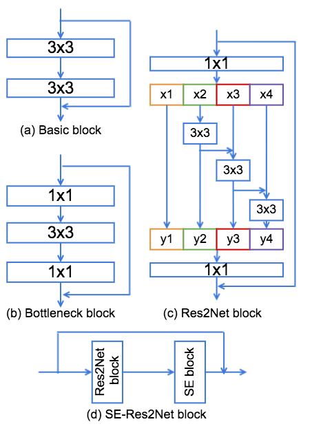
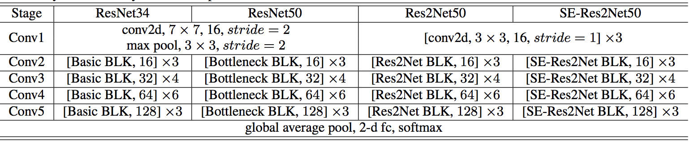
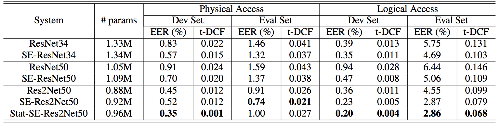
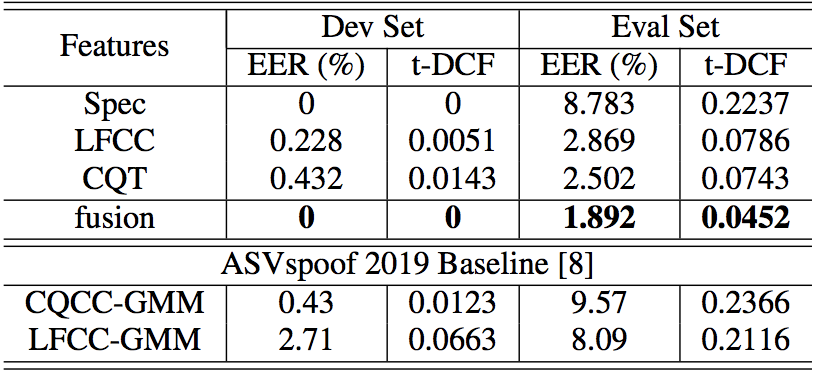

# ASV-anti-spoofing-with-Res2Net
This repository provides the implementation of the paper:
[Replay and Synthetic Speech Detection with Res2Net architecture](https://arxiv.org/abs/2010.15006).

## System Architecture

1. ResNet blocks



2. Overall model architecture


## Main Results
1. System performance on the ASVspoof2019 PA and LA dataset. (The input features for PA and LA are Spec and LFCC, respectively.)



2. System performance on the ASVspoof2019 PA of SE-Res2Net50 with different input features.


3. System performance on the ASVspoof2019 LA of SE-Res2Net50 with different input features.


## Dependencies

1. Python and packages

    This code was tested on Python 3.7 with PyTorch 1.6.0.
    Other packages can be installed by:

    ```bash
    pip install -r requirements.txt
    ```

2. Kaldi-io-for-python

    kaldi-io-for-python is a python package that is used for reading and writing data of `ark,scp` kaldi format.
    See `README.md` in [kaldi-io-for-python](https://github.com/vesis84/kaldi-io-for-python) for installation.

3. MATLAB

   The LFCC feature adopted in this work is extracted via the MALTAB codes privided by ASVspoof2019 orgnizers.

## Dataset
   This work is conducted on [ASVspoof2019 Dataset](https://arxiv.org/pdf/1904.05441.pdf), which can be downloaded via https://datashare.ed.ac.uk/handle/10283/3336. It consists of two subsets, i.e. physical access (PA) for replay attacks and logical access (LA) for synthetic speech attacks.

## Start Your Project
   This repository mainly consists of two parts: (i) feature extraction and (ii) system training and evaluation.

### Feature extraction
   Three features are adopted in this repo, i.e. Spec, LFCC and CQT. The top script for feature extraction is `extract_feats.sh`, where the first step (Stage 0) is required to prepare dataset before feature extraction. It also provides feature extraction for Spec (Stage 1) and CQT (Stage 2), while for LFCC extraction, you need to run the `./baseline/write_feature_kaldi_PA_LFCC.sh` and `./baseline/write_feature_kaldi_LA_LFCC.sh` scripts. All features are required to be truncated by the Stage 4 in `extract_feats.sh`.

   Given your dataset directory in `extract_feats.sh`, you can run any stage (e.g. NUM) in the `extract_feats.sh` by
   ```bash
   ./extract_feats.sh --stage NUM
   ```
   For LFCC extraction, you need to run
   ```bash
   ./baseline/write_feature_kaldi_LA_LFCC.sh
   ./baseline/write_feature_kaldi_PA_LFCC.sh
   ```

### System training and evaluation
   This repo supports different system architectures, as configured in the `conf/training_mdl` directory. You can specify the system architecture, acoustic features in `start.sh`, then run the codes below to train and evaluate your models.
   ```bash
   ./start.sh
   ```
   Remember to rename your `runid` in `start.sh` to differentiate each configuration.
   From our experiments after ICASSP 2021 submission, we observe that SERes2Net50 configured with `14w_8s` and `26w_8s` can achieve slightly better performance.


## Citation
If this repo is helpful with your research or projects, please kindly star our repo and cite our paper as follows:
```
@article{li2020replay,
  title={Replay and Synthetic Speech Detection with Res2net Architecture},
  author={Li, Xu and Li, Na and Weng, Chao and Liu, Xunying and Su, Dan and Yu, Dong and Meng, Helen},
  journal={arXiv preprint arXiv:2010.15006},
  year={2020}
}
```

## Contact

- [Xu Li](https://lixucuhk.github.io/) at the Chinese University of Hong Kong (xuli@se.cuhk.edu.hk, xuliustc1306@gmail.com)
- If you have any questions or suggestions, please feel free to contact Xu Li via xuli@se.cuhk.edu.hk or xuliustc1306@gmail.com.

